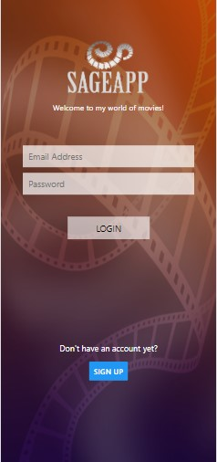

The application authenticates users and add lists of movies they have watched into favorites, and list of coming soon that interest the users.

#### Frontend
A react native, mobile frontend application.

#### Backend
Java servlets and Java Restful web services was used for the backend.

#### Server
Google app engine standard, that runs on local machine and also deployed to GCP(Google Cloud Engine) at final stage. 

#### Database
Local MySQL using command line and Workbench
MySQL instance in the Google Cloud database and Google cloud Datastore

####ScreenShots of the Mobile Applications

   |    

#### How to run the react native app.

1.  download or clone the app.
2.  navigate to the directory from a terminal or in an IDE terminal
  2.1 run from the terminal the following commands.
3   npm install --global expo-cli 
  3.1 npm install
  3.2 npm start or expo start
  3.3 wait till it shows press W to view in the browser.
